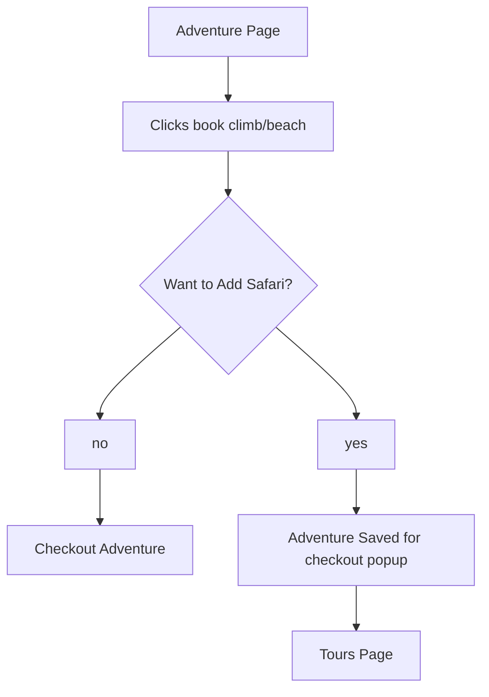

```mermaid


flowchart TD

start["Adventure Page"] --> clicks_book["Clicks book climb/beach"]
clicks_book --> add_safari{"Want to Add Safari?"}
add_safari --> no & yes
no --> request_adventure["Checkout Adventure"]
yes --> adventure_saved["Adventure Saved for checkout popup"]
adventure_saved --> tours_page["Tours Page"]

```
