# Userflow FlowChart
---

### What are your visitor’s needs?
- Unique and immersive safari experiences
- Connection with nature and wildlife
- Exploration of African cultures
- Hassle-free booking process and personalized itineraries
### What problems do they want to resolve?
- Finding a reliable and reputable safari company
- Transparent pricing and communication
- Safe and well-organized travel
- Avoiding logistical issues and travel challenges
### What design features are necessary to help them educate themselves?
- Clear information on safari packages
- Detailed destination and activity descriptions
- Captivating photo and video galleries
- Informative blog articles on wildlife, culture, and travel tips
### Do they have any concerns about your product that you can address?
- Safety measures and precautions
- Environmental impact and responsible travel
- Wildlife protection initiatives and eco-friendly practices
- Community engagement and ethical tourism commitment

```mermaid


flowchart TD

subgraph Simple
direction TB
A([Land]):::someclass --> B[Learns Bapta hosts cheap and good safaris]
B --> C[Picks Tour] --> D[Requests Tour] --> E[Adds on a Zanzibar Extension]
end


subgraph Complex
landing_page([Landing Page]) --> clicks_find_tour[Clicks Find a Tour]

clicks_find_tour --> tours[Tours Page]

landing_page --> scrolls1[Scrolls Down]
landing_page --> clicks_why_choose_us[Clicks Why Choose Us]
scrolls1 --> reads_emmanuels_quote[Reads Emmanuels Quote]
reads_emmanuels_quote --> scrolls2[Scrolls Down] 
scrolls2 --> testimonial_snippet[Reads Testimonials]

clicks_why_choose_us --> reads_emmanuels_quote
testimonial_snippet --> scrolls3[Scrolls Down]
scrolls3 --> top_tours[Top Rated Tours Section]
top_tours --> clicks_more_tours[Clicks More Tours]
clicks_more_tours --> tours


top_tours & tours --> clicks_a_tour[Clicks on a Tour]
clicks_a_tour --> reads_more[Reads more about the tour]
reads_more --> clicks_request[Clicks Requests Quote]
clicks_request --> fills_form[Fills in the form]
end

subgraph Landing_Page
Hero --> Stars --> Emmanuel_Quote --> Testimonials --> Top_Tours --> Adventures --> CTA_book_tour --> About_Bapta --> FAQ --> CTA_book_tour1
end

```

