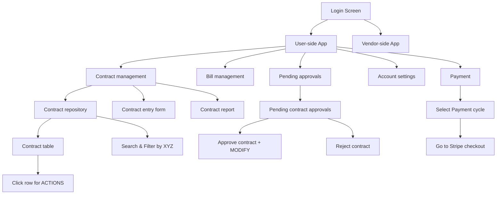

## CONTRACT COLUMNS:

## CONTRACT ROW ACTIONS:

| Actions | Description |
|---------|-------------|
| MODIFY  |             |
| DELETE  |             |
| VIEW    | maybe some in-depth info  |
| ADD_CHILD |           |
| PAY?    |  should contract be billed from here?|


## ACCOUNT SETTINGS:

| Field              | Description                           |
|--------------------|---------------------------------------|
| Company code       | Unique ID for the company      |
| Name               | Username/first-name of the user        |
| Email              | Email address of the company           |
| Password           | Password for the user (stars unless otherwise)  |
| User ID            | Immutable user ID                      |
| Approval threshold | Threshold for single-amount contract approvals       |
| Approver           | User responsible for approving this user's contracts |
| Approvees          | List of users this user is responsible for approving |
```