```mermaid

mindmap
    root((Oak))
        👋 Landing Page
        💲 Pricing Page
        ✍️ Login/Register Page
            Email Authentication
        📱 User-side App
            💼 Contract Management
                🗃️ Contract repository
                    📑 Contract table
                    🔍 Search & Filter by XYZ
                📝 Contract entry form
                📊 Contract report
            📝 Bill management
                ...
            📩 Pending approvals
                📋 Pending contract approvals
                📋 Pending bill approvals
                📋 Pending contract reviews
            ⚙️ Account settings
            💰 Payment
                🔄 Select Payment cycle
                💳 Go to Stripe checkout
            ⏳ Company Logs
                🗃️ Contract logs
                    ➕ Contract created
                        ⏰ date-time of event, 📜 Entire contract item
                    🔄 Contract modified
                        ⏰ date-time of event, 🆔 ID, fields modified, old value & new value for each.
                    🗑️ Contract deleted
                        ⏰ date-time of event, 📜 Entire contract item
                🗃️ Bill logs
                🗃️ User logs
                    ➕ User created
                        ⏰ date-time of event, 📜 Entire user item
                    📲 User login
                        ⏰ date-time of event, 🆔 User ID
                    🚪 User logout
                        ⏰ date-time of event, 🆔 User ID
                    🗑️ User deleted
                        ⏰ date-time of event, 📜 Entire user item
                    🔄 User modified
                        ⏰ date-time of event, 🆔 ID, fields modified, old value & new value for each.
                🗃️ Payment logs
                    💸 Item paid, billing modified, refund requested, refund approved, refund denied
        Vendor-side App
            Post MVP
            
```

-----------------

### CONTRACT ENTRY FORM:
| Field           | Description       |
|-----------------|-------------------|
| Parent Contract | Parent contract to autofill |
| Start Date      | Date Field        |
| End Date        | Date Field        |
| Description     | Free Text Field   |
| Project Code    | Data Validation if customer chooses to have Projects |
| Owner           | Drop-down of employees, default to self |
| Approver        | Drop-down of employees, default to {self}@jared |
| Department      | Drop-down with preconfigured  |
| Amount          |     |
| Spend Category  | Contract, Clinical, and Other as the 3 categories for the first version |

### CONTRACT DATATABLE:
- Contains contracts accross the entire database of users and companies. Contracts are linked to their company via the company code field.

| Field           | Description       |
|-----------------|-------------------|
| Company Code    | Unique secret ID for the company      |
| Contract ID     | Unique ID for the contract (immutable)|
| Created at      | Date+Time Field   (immutable) |
| Parent Contract | A contract ID of the parent contract |
| Start Date      | Date Field        |
| End Date        | Date Field        |
| Description     | Free Text Field   |
| Project Code    | Project code ({custom type}@jonas{can we make enum types in a db? or array of strings?}) |
| Owner           | User ID / username, defaulted to self |
| Approver        | User Id / username, defaulted to {default approver}@jared{does default approver exist?} |
| Department      | department code (custom type), defaulted to contract |
| Amount          |  |
| Spend Category  | Drop-down |
| Contract Attachment | PDF or img of contract stored as a file |

### CONTRACT ACTIONS:
| Actions | Description |
|---------|-------------|
| MODIFY  |             |
| DELETE  |             |
| VIEW    | maybe some in-depth info  |
| ADD_CHILD |           |
| PAY?    |  should contract be billed from here?|

-----------------

### LOGIN FORM: 
| Field        | Description                           |
|--------------|---------------------------------------|
| Full Name    | User's full name                       |
| Email        | User's email address                   |
| Password     | User's password (hidden)               |
| Company Code | Unique secret ID for the company       |

### USER DATATABLE:

| Field              | Description                           |
|--------------------|---------------------------------------|
| Company code       | Unique secret ID for the company      |
| User ID            | Immutable user ID                      |
| Name               | Username/first-name of the user        |
| Email              | Email address of the company           |
| Password           | Password for the user  |
| Approval threshold | Threshold for single-amount contract approvals       |
| {Approver}@jared{is approver constant?} | User responsible for approving this user's contracts |

## ACCOUNT SETTINGS:
| Field              | Description                          |
|--------------------|--------------------------------------|
| Company code       | Unique secret ID for the company     |
| Name               | Username/first-name of the user      |
| Email              | Email address of the company         |
| Password           | Password for the user                |
| User ID            | Immutable user ID                    |
| Approval threshold | Threshold for single-amount contract approvals (admin-only modifiable) |
| Approver           | User responsible for approving this user's contracts (admin-only modifiable) |
| Approvees          | List of users this user is responsible for approving |

-----------------

### COMPANY DATATABLE:
- Datatable to organise multiple companies and their users. Used for employee managment & hierarchy, sorting contracts, billing information. Not a very front-facing table; only admins of a company will be able to modify and view this.

| Field              | Description                          |
|--------------------|--------------------------------------|
| Company code       | Unique secret ID for the company     |
| Name               | Name of the company                  |
| Employees          | List of user IDs of employees        |