```mermaid

mindmap
    root((Oak))
        👋 Landing Page
        💲 Pricing Page
        ✍️ Login/Register Page
            📧 Email Authentication 
        📱 User-side App
            💼 Contract Management
                🗃️ Contract repository
                    📑 Contract table
                    🔍 Search & Filter by XYZ
                📝 Contract entry form
                📊 Contract report
            📝 Bill management
                ...
            📩 Notifications
                📋 Pending contract approvals
                📋 Pending bill approvals
                📋 Pending contract reviews
                📋 Requested admin help
            ⚙️ Account settings
                📝 Edit profile
                📝 Edit notification settings
                📝 Edit approval settings
            ⚙️ Company settings (admin only)
                📝 Edit user accounts
                    📝 Edit permissions
                    📝 Edit approvers
                    📝 Edit approval thresholds
                📝 Edit company billing settings
            💰 Payment
                🔄 Select Payment cycle
                💳 Go to Stripe checkout
            ⏳ Company Logs
                🗃️ Contract logs
                    ➕ Contract created
                        ⏰ date-time of event, 📜 Entire contract item
                    🔄 Contract modified
                        ⏰ date-time of event, 🆔 ID, fields modified, old value & new value for each.
                    🗑️ Contract deleted
                        ⏰ date-time of event, 📜 Entire contract item
                🗃️ Bill logs
                🗃️ User logs
                    ➕ User created
                        ⏰ date-time of event, 📜 Entire user item
                    📲 User login
                        ⏰ date-time of event, 🆔 User ID
                    🚪 User logout
                        ⏰ date-time of event, 🆔 User ID
                    🗑️ User deleted
                        ⏰ date-time of event, 📜 Entire user item
                    🔄 User modified
                        ⏰ date-time of event, 🆔 ID, fields modified, old value & new value for each.
                🗃️ Payment logs
                    💸 Item paid, billing modified, refund requested, refund approved, refund denied
        Vendor-side App
            Post MVP
            
```

-----------------

### CONTRACT ENTRY FORM:
| Field           | Description       |
|-----------------|-------------------|
| Parent Contract | Parent contract to autofill |
| Start Date      | Date Field        |
| End Date        | Date Field        |
| Description     | Free Text Field   |
| Project Code    | Data Validation if customer chooses to have Projects |
| Owner           | Drop-down of employees, default to self |
| Approver        | Drop-down of employees, default to {self}@jared |
| Department      | Drop-down with preconfigured  |
| Amount          |     |
| Spend Category  | Contract, Clinical, and Other as the 3 categories for the first version |

### CONTRACT DATATABLE:
- Contains contracts accross the entire database of users and companies. Contracts are linked to their company via the company code field.

| Field           | Description       |
|-----------------|-------------------|
| Company Code    | Unique secret ID for the company      |
| Contract ID     | Unique ID for the contract (immutable)|
| Created at      | Date+Time Field   (immutable) |
| Parent Contract | A contract ID of the parent contract |
| Start Date      | Date Field        |
| End Date        | Date Field        |
| Description     | Free Text Field   |
| Project Code    | Project code ({custom type}@jonas{can we make enum types in a db? or array of strings?}) |
| Creator         | User ID / username, defaulted to self |
| Approver        | User Id / username, defaulted to default approver |
| Department      | department code (custom type), defaulted to contract |
| Amount          |  |
| Spend Category  | Drop-down |
| Contract Attachment | PDF or img of contract stored as a file |

### CONTRACT ACTIONS:
| Actions | Description |
|---------|-------------|
| MODIFY  |             |
| DELETE  |             |
| VIEW    | maybe some in-depth info  |
| ADD_CHILD |           |
| PAY?    |  should contract be billed from here?|

-----------------

### LOGIN FORM: 
| Field        | Description                           |
|--------------|---------------------------------------|
| Full Name    | User's full name                       |
| Email        | User's email address                   |
| Password     | User's password (hidden)               |
| Company Code | Unique secret ID for the company       |

### PROFILES DATATABLE:
| Field               | Description                                          |
|---------------------|------------------------------------------------------|
| Company code        | Unique secret ID for the company                     |
| User role           | Enum from {"admin", "signatory", "default"}          |
| User ID             | Immutable user ID from auth.users                    |
| Name                | Username/first-name of the user                      |
| Email               | Email address of the company                         |
| Password            | Password for the user                                |
| Approval threshold  | Threshold for single-amount contract approvals       |
| Default Approver(s) | IDs of                                               |

### APPROVERS DATATABLE:
| Field              | Description                          |
|--------------------|--------------------------------------|
| User ID            | User ID of approvee                  |
| Approver           | User ID of approver                  |

## ACCOUNT SETTINGS:
| Field              | Description                              |
|--------------------|------------------------------------------|
| Company code       | Unique secret ID for the company (star)  |
| Name               | Username/first-name of the user          |
| Email              | Email address of the company             |
| Password           | Password for the user (star)             |
| Approval threshold | Threshold for single-amount contract approvals (admin-only modifiable (AOM)) |
| Approver(s)        | User(s) responsible for approving this user's contracts (AOM)                |
| Approvee(s)        | User(s) this user is responsible for approving (AOM)                         |

-----------------

## LOG DATATABLE:
| Field              | Description                            |
|--------------------|----------------------------------------|
| Created at         | Unique secret ID for the company       |
| User ID            | ID of user that caused the log         |
| {Company code}@jonas{should we just get company code from the profiles table using user.id instead of storing here?} | Unique secret ID for the company  |
| Event              | Enum from Log Events                   |
| Fields modified    | List of fields modified                |
| Old data           | Data before changes                    |
| New data           | Data after changes                     |

## LOG EVENTS:
| Event              | 
|--------------------|
| Contract Created   |
| Contract Modified  |
| Contract Deleted   |
| User Created       |
| User Login         |
| User Logout        |
| User Deleted       |
| User Modified      |
| Payment Events     |

## Log example
|  Created at 16-1-2024@16:00:20  |  User 123456abcdef  | Company 98765aoeui  |  Contract Created  | all fields modified (n/a) |  n/a  |  { contract: {...} }  |

-----------------

### COMPANY DATATABLE:
- Datatable to organise multiple companies and their users. Used for employee managment & hierarchy, sorting contracts, billing information. Not a very front-facing table; only admins of a company will be able to modify and view this.

| Field              | Description                          |
|--------------------|--------------------------------------|
| Company code       | Unique secret ID for the company     |
| Name               | Name of the company                  |
| Employees          | List of user IDs of employees        |